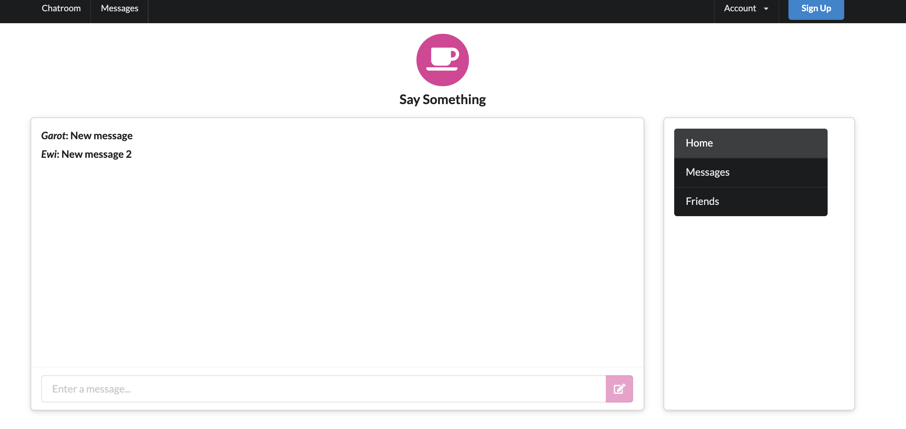
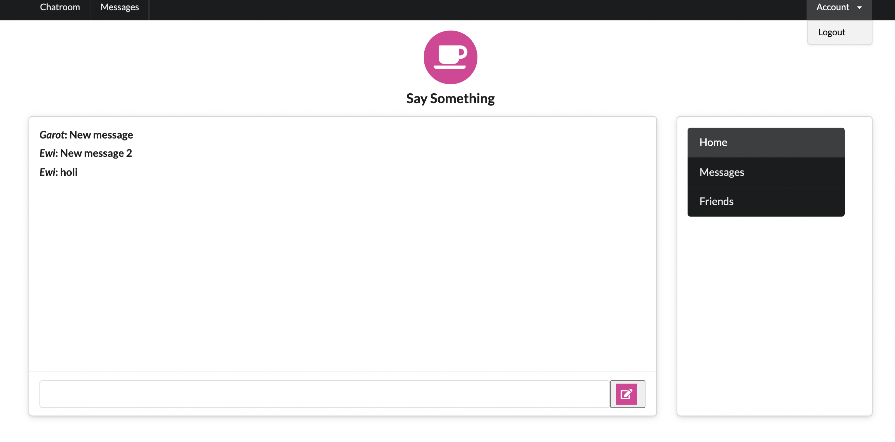

# Message-Me

Versión de Ruby: ruby '2.3.4'

Versión de Rails: gem 'rails', '~> 5.2.6'

***Entorno de producción para la Base de datos:***

```ruby

group :development, :test do
  gem 'byebug', platforms: [:mri, :mingw, :x64_mingw]
  gem 'sqlite3'
end

group :production do
  gem 'pg'#, '~> 1.2', '>= 1.2.3'
end
````

### Instalar gem:

Para la interfás gráfica(FrontEnd) de nuestra app utilizaremos: `semantic-ui-sass` y `jquery-rails`.

```ruby
gem 'semantic-ui-sass'
gem 'jquery-rails'
```

***Importar los comandos de interfás gráfica:***

Crear un archivo con extensión scss: `custom.css.scss`, en el agregar lo siguiente: `@import 'semantic-ui';`.

En el Archivo application.js agreagar la siguiente linea:


```js
//= require jquery
//= require semantic-ui
```

Nos debe quedar de la siguiente manera:

```js
//= require rails-ujs
//= require jquery
//= require activestorage
//= require turbolinks
//= require semantic-ui
//= require_tree .
```

1.- `rails g model User`

2.- Model update:


```ruby
class User < ApplicationRecord
  validates :username, presence: true, uniqueness: true, length: { minimum: 3, maximum: 15 }
  has_secure_password
end
```

> 3.- Seeds:
  3.1.- `rails db:seed`
  3.2.- `rails c`
  3.3- `User.all`


> Vista de nuestros usuarios creados en orden con: `gem 'hirb'`
  rails c

```shell
2.3.4 :001 > Hirb.enable
 => true
```  

```shell
2.3.4 :002 > User.all
  User Load (0.6ms)  SELECT "users".* FROM "users"
+----+-----------+----------------------+----------------------+-----------------------+
| id | username  | password_digest      | created_at           | updated_at            |
+----+-----------+----------------------+----------------------+-----------------------+
| 1  | Ewi       | $2a$12$ZE4WILMcuC... | 2021-10-05 00:33:... | 2021-10-05 00:33:0... |
| 2  | Galadriel | $2a$12$k0BlGeTFWU... | 2021-10-05 00:36:... | 2021-10-05 00:36:5... |
| 3  | Frodo     | $2a$12$/WYBNrR7pR... | 2021-10-05 00:36:... | 2021-10-05 00:36:5... |
| 4  | Sam       | $2a$12$vpubmIq5FO... | 2021-10-05 00:36:... | 2021-10-05 00:36:5... |
| 5  | Gandalf   | $2a$12$tboBqZPgaj... | 2021-10-05 00:36:... | 2021-10-05 00:36:5... |
| 6  | Garot     | $2a$12$Gh7/ZdlVS1... | 2021-10-05 00:36:... | 2021-10-05 00:36:5... |
+----+-----------+----------------------+----------------------+-----------------------+
6 rows in set
```


1.- `rails g model Messages`

2.- `rails db:migrate`

3.- Model Message:

```ruby
  class Message < ApplicationRecord
  belongs_to :user
  validates :body, presence: true
end
```

4.- Model User:

```ruby
class User < ApplicationRecord
  validates :username, presence: true, length: { minimum: 3, maximum: 15 },
            uniqueness: { case_sensitive: false }
  has_many :messages
  has_secure_password
end
```

Console:

```shell
> Message.create(body: 'New message', user: User.last)
```

```shell
> Message.create(body: 'New message', user: User.last)

+----+-------------+---------+-------------------------+-------------------------+
| id | body        | user_id | created_at              | updated_at              |
+----+-------------+---------+-------------------------+-------------------------+
| 1  | New message | 6       | 2021-10-05 01:03:52 UTC | 2021-10-05 01:03:52 UTC |
+----+-------------+---------+-------------------------+-------------------------+
1 row in set

```

### ¿Cómo está quedando?



Inicio de sesión para usuari@s:

`rails g controller sessions new`


Crear una sala de chat:

`rails g channel chatroom`

¿Cómo está quedando el chatroom?



Scope de la variable:

Para definir cuantos mensajes queremos que se nos vea en nuestra pantalla de chat, lo haremos con un `scope`, que definiresmos asi:

```ruby
  scope :custom_display, -> { order(:created_at).last(20) }

```

